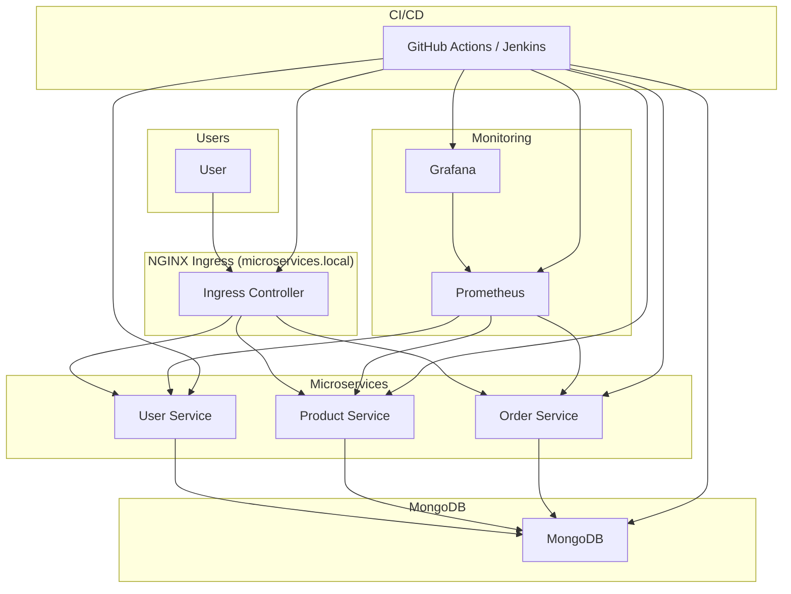

# Microservices Architecture with Kubernetes, Docker, MongoDB, Prometheus, Grafana, Ingress, Helm, and CI/CD

## Architecture Diagram



## Overview

This project demonstrates a robust microservices architecture using Docker and Kubernetes, featuring:
- Three Node.js microservices (User, Product, Order) with MongoDB integration
- Kubernetes manifests and a Helm chart for easy deployment
- NGINX Ingress for API gateway/routing
- Monitoring with Prometheus and Grafana
- Automated CI/CD with Jenkins and GitHub Actions

## Directory Structure

```
user-service/        # User microservice (Node.js, MongoDB)
product-service/     # Product microservice (Node.js, MongoDB)
order-service/       # Order microservice (Node.js, MongoDB)
k8s/                 # Kubernetes manifests (Deployments, Services, Ingress, MongoDB)
monitoring/          # Prometheus, Grafana configs and manifests
ci-cd/               # Jenkins pipeline (Jenkinsfile)
helm/                # Helm chart for the entire stack
.github/workflows/   # GitHub Actions workflow for CI/CD
```

## Getting Started

### Prerequisites
- Docker
- Kubernetes (Minikube, kind, or a cloud provider)
- kubectl
- Node.js (for local development)
- Jenkins (for CI/CD)
- Helm

### 1. Build and Run Microservices Locally

```
cd user-service && npm install && npm start
cd product-service && npm install && npm start
cd order-service && npm install && npm start
```

### 2. Build Docker Images

```
docker build -t user-service:latest ./user-service
docker build -t product-service:latest ./product-service
docker build -t order-service:latest ./order-service
```

### 3. Deploy to Kubernetes (Manifests)

```
kubectl apply -f k8s/
kubectl apply -f monitoring/
```

### 4. Deploy with Helm (Recommended)

```
helm upgrade --install microservices-architecture ./helm
```

### 5. Access Services
- Ingress: Add `127.0.0.1 microservices.local` to your `/etc/hosts` and use `http://microservices.local/user/`, `/product/`, `/order/`
- Prometheus: `kubectl port-forward svc/prometheus 9090:9090`
- Grafana: `kubectl port-forward svc/grafana 3000:3000`

### 6. CI/CD Pipeline
- Jenkins: Use `ci-cd/Jenkinsfile`
- GitHub Actions: See `.github/workflows/ci-cd.yml`
- Configure Docker Hub and Kubeconfig secrets for GitHub Actions

## Monitoring & Observability
- **Prometheus** scrapes metrics from all microservices
- **Grafana** provides dashboards for real-time monitoring
- Customize `monitoring/prometheus-config.yaml` or Helm values to add more scrape targets

## Best Practices
- Each microservice is independently deployable and scalable
- Use health checks (`/health` endpoint) for readiness and liveness probes
- Centralized logging and monitoring for observability
- Automated CI/CD for rapid, reliable deployments
- Secure secrets and sensitive data using Kubernetes Secrets (not included in this public repo)

## Extending the Architecture
- Add more microservices by copying the template structure
- Integrate with databases or external APIs as needed
- Enhance security with RBAC, network policies, and TLS

## License
MIT 